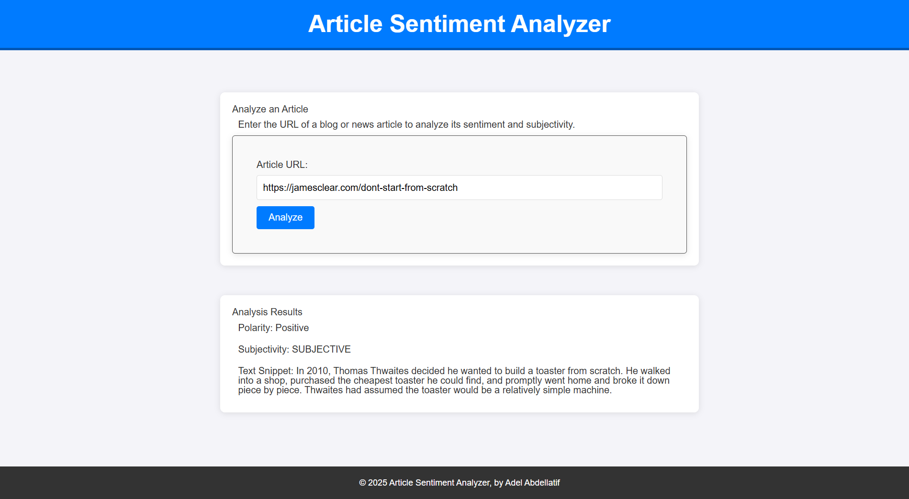

# Evaluate a News Article with Natural Language Processing

## Project Description

This project uses MeaningCloud's Sentiment Analysis API to analyze the sentiment and subjectivity of a news article or blog post based on its URL. It provides a user-friendly interface to input a URL and displays key insights such as polarity, subjectivity, and a snippet of analyzed text.

The project is the fourth project of the Udacity Front-End Developer Nanodegree. It is built with modern web development tools and practices, including Webpack, Sass, and Express.js. It also demonstrates the use of a service worker for offline functionality in production.

---

## Features

- Analyze the sentiment of any publicly accessible article or blog post.
- Display polarity, subjectivity, and a text snippet of the analysis.
- Responsive and clean UI styled with Sass.
- Built with Webpack for optimized builds.
- Offline functionality via a service worker.

---

## Screenshot



---

## Getting Started

### Prerequisites

Ensure you have the following installed on your system:

- Node.js (v14 or later)
- npm (v6 or later)

### Installation

1. Clone the repository:

   ```bash
   git clone https://github.com/THEPEACEMAKER/evaluate-news-nlp
   cd evaluate-news-nlp/starter_project
   ```

2. Install dependencies:

   ```bash
   npm install
   ```

3. Create a `.env` file in the root directory and add your MeaningCloud API key:

   ```plaintext
   MEANINGCLOUD_API_KEY=your_api_key_here
   ```

4. Add `.env` to `.gitignore` to protect your API key:
   ```plaintext
   .env
   ```

---

## Running the App

### Development Mode

1. Start the development server:
   ```bash
   npm run build-dev
   ```
2. Open your browser and navigate to `http://localhost:8080`.

### Production Mode

1. Build the production files:
   ```bash
   npm run build-prod
   ```
2. Start the server:
   ```bash
   npm start
   ```
3. Open your browser and navigate to `http://localhost:8000`.

---

## Project Structure

```
project-root
├── starter_project
│   ├── src
│   │   ├── client
│   │   │   ├── js
│   │   │   │   ├── polarityMapper.js
│   │   │   │   ├── urlChecker.js
│   │   │   │   ├── formHandler.js
│   │   ├── styles
│   │   │   ├── SCSS stylesheets
│   │   ├── views
│   │   │   ├── index.html
│   │   └── index.js
│   ├── server
│   │   └── index.js
│   ├── tests
│   │   ├── polarityMapper.test.js
│   │   ├── urlChecker.test.js
│   ├── .env
│   ├── .gitignore
│   ├── package.json
│   ├── webpack.dev.js
│   ├── webpack.prod.js
├── README.md
```

---

## Testing

Unit tests are written using Jest. To run the tests:

```bash
npm test
```

---

## Acknowledgments

- [Udacity Front-End Nanodegree Program](https://www.udacity.com/course/front-end-web-developer-nanodegree--nd0011)
- [MeaningCloud Sentiment Analysis API](https://www.meaningcloud.com/developer/sentiment-analysis)

---

Adel Abdellatif  
GitHub: [THEPEACEMAKER](https://github.com/THEPEACEMAKER)  
LinkedIn: [Adel A. Abdelkader](https://www.linkedin.com/in/adel-a-abdelkader/)
